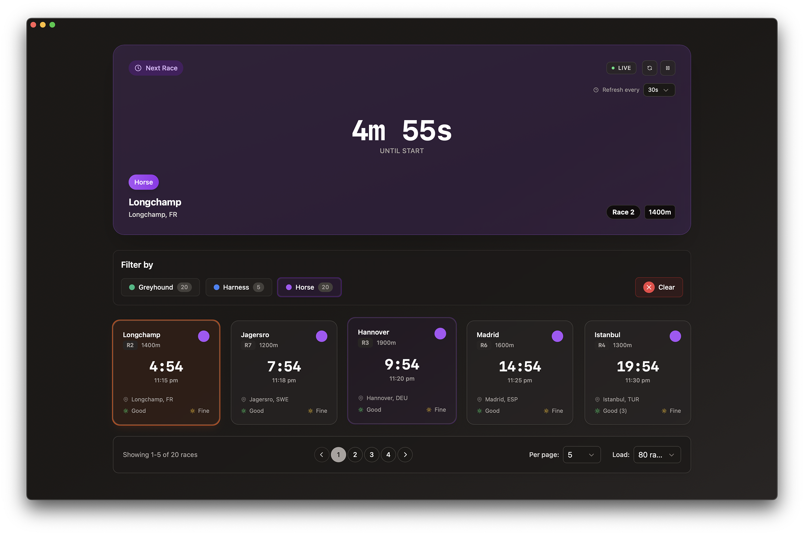

# foal

> A modern desktop racing app for tracking next-to-go horse, harness, and greyhound races with live countdown timers and category filtering.

[](https://github.com/atextual/foal/actions/workflows/test.yml)
[](https://vuejs.org/)
[](https://nuxt.com/)
[](https://tauri.app/)
[](https://www.typescriptlang.org/)

### **Web Version:** [foal.textual.au](https://foal.textual.au)



---

## Download Local Application

| Platform | Architecture             | Download                                                                                                         |
| -------- | ------------------------ | ---------------------------------------------------------------------------------------------------------------- |
| macOS    | Apple Silicon (M1/M2/M3) | [foal_0.1.0_aarch64.dmg](https://github.com/atextual/foal/releases/download/v0.1.0/foal_0.1.0_aarch64.dmg)       |
| macOS    | Intel                    | [foal_0.1.0_x64.dmg](https://github.com/atextual/foal/releases/download/v0.1.0/foal_0.1.0_x64.dmg)               |
| Windows  | x64                      | [foal_0.1.0_x64-setup.exe](https://github.com/atextual/foal/releases/download/v0.1.0/foal_0.1.0_x64-setup.exe)   |
| Linux    | x64 (AppImage)           | [foal_0.1.0_amd64.AppImage](https://github.com/atextual/foal/releases/download/v0.1.0/foal_0.1.0_amd64.AppImage) |
| Linux    | x64 (deb)                | [foal_0.1.0_amd64.deb](https://github.com/atextual/foal/releases/download/v0.1.0/foal_0.1.0_amd64.deb)           |

---

## Quick Start (Smart Cookies Only 🍪)

```bash
# Install dependencies
yarn install

# Development (web)
yarn dev

# Development (desktop)
yarn tauri:dev

# Build desktop app
yarn tauri:build
```

---

## Features

- **Live countdown timers** for upcoming races
- **Category filtering** (Greyhound, Harness, Horse)
- **Auto-refresh** with configurable intervals
- **Real-time updates** with automatic race expiration
- **Dark mode** support
- **Cross-platform** desktop app (macOS, Windows, Linux)

---

## Tech Stack

- **Vue 3** + **Nuxt 3** - Modern reactive UI framework
- **Tauri** - Lightweight desktop app framework
- **TypeScript** - Type-safe development
- **Pinia** - State management
- **Tailwind CSS** - Utility-first styling
- **VueUse** - Composition utilities

---

## Architecture

### Component Design

**Separation of Concerns**

- **Presentational components** handle UI rendering
- **Composables** encapsulate business logic
- **Stores** manage global state
- **Utils** provide pure helper functions

**Key Components:**

**`RaceList.vue`** - Smart container component

- Orchestrates data fetching via `useRaceApi` composable
- Manages pagination and filtering state
- Handles loading, error, and empty states
- Auto-refresh with configurable intervals using VueUse

**`RaceCard.vue`** - Presentational race display

- Receives race data as props (single source of truth)
- Uses `useCountdown` composable for live timer logic
- Visual states: normal, starting soon, critical, expired
- Fully reactive to prop changes

**`RaceHUD.vue`** - Live statistics overlay

- Computed values from Pinia stores (no local state)
- Real-time countdown to next race
- Auto-refresh controls with pause/resume
- Responsive layout adapts to screen size

**`CategoryFilter.vue`** - Stateless filter UI

- Reads/writes to Pinia filter store
- Multi-select with visual feedback
- Persists selections to localStorage
- Race count badges per category

### Composables (Reusable Logic)

**`useRaceApi.ts`** - API integration layer

- Handles Tauri HTTP client for CORS bypass
- Retry logic with exponential backoff
- Polling management (start/stop/restart)
- Type-safe response parsing

**`useCountdown.ts`** - Timer logic

- Accepts reactive or static target time
- Multiple display formats (full, compact, minimal)
- Status indicators (starting soon, critical, expired)
- Auto-cleanup on unmount

### State Management

**`stores/races.ts`** - Race data lifecycle

- Fetches and caches race data
- Automatic expiration management
- Pagination logic
- Sorted and filtered getters

**`stores/filters.ts`** - Filter preferences

- Category selection state
- LocalStorage persistence
- Computed filter status

### Extensibility

**Adding a new race category:**

1. Add to `RACE_CATEGORIES` in `types/index.ts`
2. Filter automatically appears in UI
3. No component changes needed

**Adding a new data source:**

1. Implement in `useRaceApi` composable
2. Return same `Race` type
3. All components work unchanged

**Custom countdown formats:**

1. Add format to `useCountdown` composable
2. Use via `getFormattedDisplay('your-format')`
3. Reusable across all components

---

## Development

```bash
# Web development
yarn dev
# Visit http://localhost:3000

# Desktop app
yarn tauri:dev

# Build desktop app
yarn tauri:build

# Run tests
yarn test

# Run tests with UI
yarn test:ui

# Generate coverage report
yarn test:coverage

# Lint code
yarn lint

# Auto-fix linting issues
yarn lint:fix

# Format code
yarn format
```

### Testing

The project includes comprehensive unit tests covering:

- **Utility Functions** (31 tests) - Date formatting, race status, track conditions, prize money
- **Composables** (17 tests) - Countdown logic, timer calculations, display formatting
- **Stores** (46 tests) - Race management, filtering, pagination, localStorage persistence

Test coverage focuses on business logic and state management, ensuring reliability of core features.

### Code Quality

**Pre-commit Hooks (Husky)**

- Automatic linting and formatting on commit
- Tests run before every commit to catch issues early
- Full test suite runs before push

**Standards**

- ESLint for code quality
- Prettier for consistent formatting
- TypeScript strict mode
- No unused variables or dead code

---

**Made by Robert Andrew** • [GitHub](https://github.com/atextual/foal)
